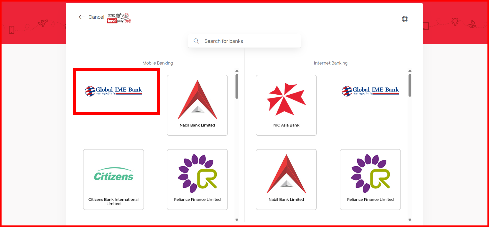

# Fonepay Integration Package

A TypeScript/JavaScript package for integrating Fonepay payment gateway into your Node.js applications.

## Installation

```bash
npm install fonepay-node
# or
yarn add fonepay-node
```

## API Reference

### createClient(params: FonepayClientParams)

Creates a Fonepay client instance with the following parameters:

```typescript
type FonepayClientParams = {
  merchantCode: string; // Merchant code provided by Fonepay
  secretKey: string; // Secret key for request verification
  fonepayBaseUrl: string; // Fonepay API base URL
};
```

### initiatePayment(params: InitiatePaymentParams)

Initiates a payment request and returns a payment URL.

```typescript
type InitiatePaymentParams = {
  amount: number; // Amount to be paid
  prn: string; // Unique Product Reference Number -> String of 3 to 25 characters
  returnUrl: string; // Your backend API endpoint that will receive Fonepay's response
  remarks1: string; // Required remarks
  remarks2?: string; // Optional additional remarks
  currency?: string; // Optional, defaults to NPR
};

type InitiatePaymentResponse = {
  url: string; // Payment URL to redirect user to
  success: boolean; // Whether the URL was generated successfully
};
```

### verifyResponse(response: FonepayResponse)

Verifies the authenticity of a payment response from Fonepay. The response parameters are received as query parameters on your returnUrl endpoint.

> **Note**: You don't need to manually construct the FonepayResponse object. When Fonepay redirects to your returnUrl, all these parameters are automatically provided as query parameters (req.query in Express.js). Simply pass these query parameters to the verifyResponse function.

```typescript
type FonepayResponse = {
  PRN: string; // Your original Product Reference Number
  PID: string; // Your Merchant ID
  PS: string; // Payment Status ("success" or "failure")
  RC: string; // Response Code ("successful" for successful payments)
  UID: string; // Unique Transaction ID from Fonepay
  BC: string; // Bank Code that processed the payment
  INI: string; // Transaction Initiator
  P_AMT: string; // Paid Amount
  R_AMT: string; // Refunded Amount (if any)
  DV: string; // Digital Verification value for response validation
};
```

## Usage Example

```typescript
import { createClient, FonepayResponse } from "fonepay-node";
import express from "express";

const app = express();

// Initialize the client
const fonepay = createClient({
  merchantCode: "YOUR_MERCHANT_CODE",
  secretKey: "YOUR_SECRET_KEY",
  fonepayBaseUrl: "https://dev-clientapi.fonepay.com/api/merchantRequest", // Use production URL in production
});

// Example Express route to initiate payment
app.post("/api/payment/initiate", async (req, res) => {
  try {
    const { amount, orderId, remarks } = req.body;

    // Generate a unique PRN (Product Reference Number)
    // Use your own logic to generate a unique PRN --> should be string of 3 to 25 characters
    const PRN = `${Date.now()}`;

    const paymentResponse = fonepay.initiatePayment({
      amount: +amount, // should be a number
      prn: PRN,
      returnUrl: "https://your-site.com/api/payment/verify", // Your backend API endpoint that will handle the verification
      remarks1: remarks || `Payment for Order #${orderId}`, // Required
      remarks2: "Optional detail", // Optional
      currency: "NPR", // Optional, defaults to NPR
    });

    if (paymentResponse.success) {
      // Store PRN in your database to match with verification response later
      // await Order.update({ id: orderId }, { prn: PRN, status: 'pending' });

      // Return the payment URL to frontend
      res.json({
        success: true,
        paymentUrl: paymentResponse.url,
      });
    } else {
      res.status(400).json({
        success: false,
        message: "Failed to initiate payment",
      });
    }
  } catch (error) {
    console.error("Payment initiation error:", error);
    res.status(500).json({
      success: false,
      message: "Internal server error",
    });
  }
});

// Frontend can then redirect to the payment URL
// window.location.href = response.paymentUrl;

// On your backend API endpoint (returnUrl), verify the payment
app.get("/api/payment/verify", async (req, res) => {
  try {
    // Fonepay will redirect to this URL with query parameters
    // You can safely typecast req.query to FonepayResponse
    const paymentResponse = req.query as FonepayResponse;

    const isValid = fonepay.verifyResponse(paymentResponse);

    if (isValid) {
      // Payment is verified successfully
      const { PRN, UID } = paymentResponse;
      // Find your order using PRN (the one you stored during payment initiation)
      // const order = await Order.findOne({ prn: PRN });

      // Update your order status
      // await order.update({ status: 'paid', transactionId: UID });

      // Redirect user to success page
      res.redirect("/payment/success");
    } else {
      // Verification failed - response might be tampered
      // Log this incident for security purposes
      console.error("Invalid payment verification:", paymentResponse);
      res.redirect("/payment/failed"); // add your failure route
    }
  } catch (error) {
    console.error("Payment verification error:", error);
    res.redirect("/payment/failed"); // add your failure route
  }
});
```

## Important Notes

1. On the fonepay test portal, the test payment works only on the Global IME Mobile Banking (as of June 2025). Use dummy details for the test payment.



2. The `returnUrl` should be a backend API endpoint (not a frontend route) that can:

   - Receive query parameters from Fonepay's redirect
   - Verify the payment response
   - Update your database with payment status
   - Redirect the user to appropriate success/failure pages

3. Always verify the payment response on your backend before confirming the payment to the user.

4. Store the `PRN` (Product Reference Number) in your database when initiating the payment so you can match it with the response.

## Error Handling

The package includes comprehensive error handling:

- All functions throw descriptive errors when required parameters are missing
- URL validation for both base URL and return URL
- Amount validation to ensure positive numbers
- Detailed error messages for debugging
- Safe handling of cryptographic operations

## Best Practices

1. **PRN (Product Reference Number)**:

   - Generate a unique PRN for each payment
   - Store it in your database when initiating the payment
   - Use it to match the payment response with your order

2. **Payment Verification**:

   - Always verify the response using `verifyResponse()` method
   - Check both `PS` (Payment Status) and `RC` (Response Code)
   - Store the `UID` as it's useful for reconciliation
   - Implement proper error handling and logging

3. **Security**:

   - Keep your `secretKey` secure and never expose it in frontend code
   - Always verify payments on your backend
   - Log failed verifications for security monitoring
   - Use HTTPS for your `returnUrl`

4. **Error Handling**:
   - Implement proper try-catch blocks in your verification endpoint
   - Log errors with relevant transaction details
   - Provide meaningful feedback to users
   - Have fallback error pages/routes

## Development

```bash
# Install dependencies
yarn install

# Build the package
yarn build
```

## License

ISC
